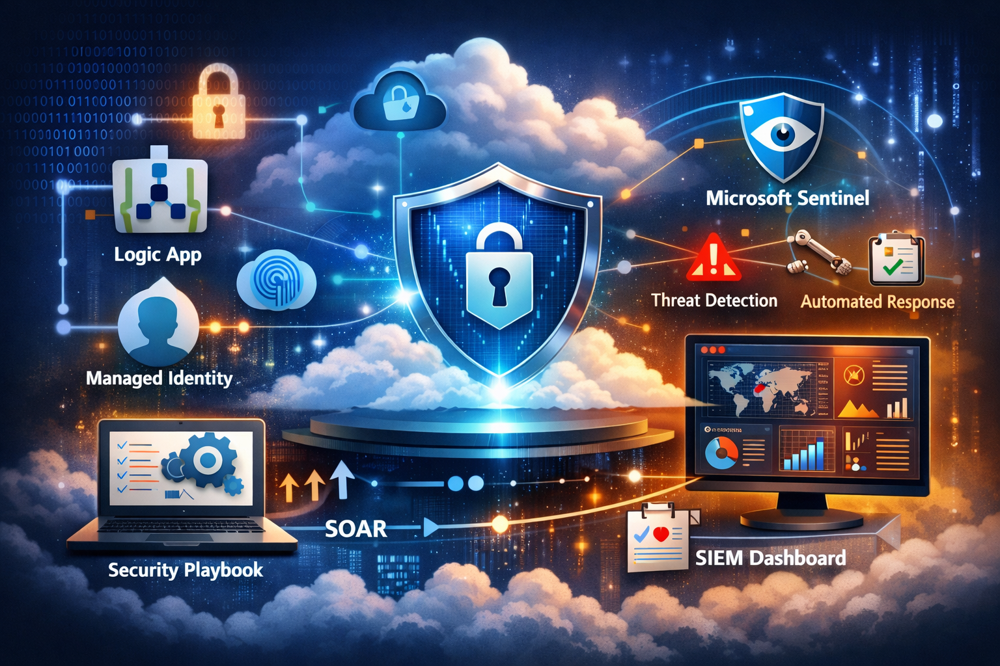
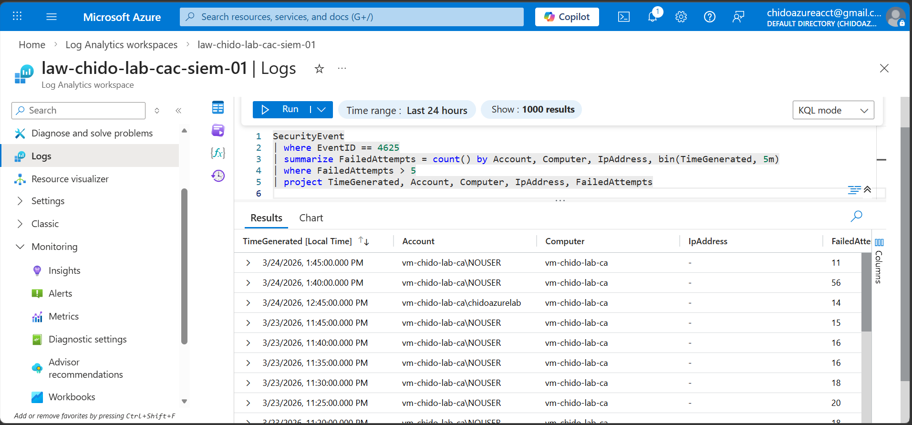
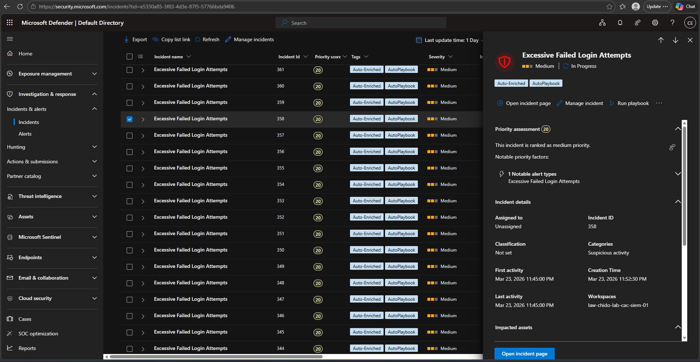
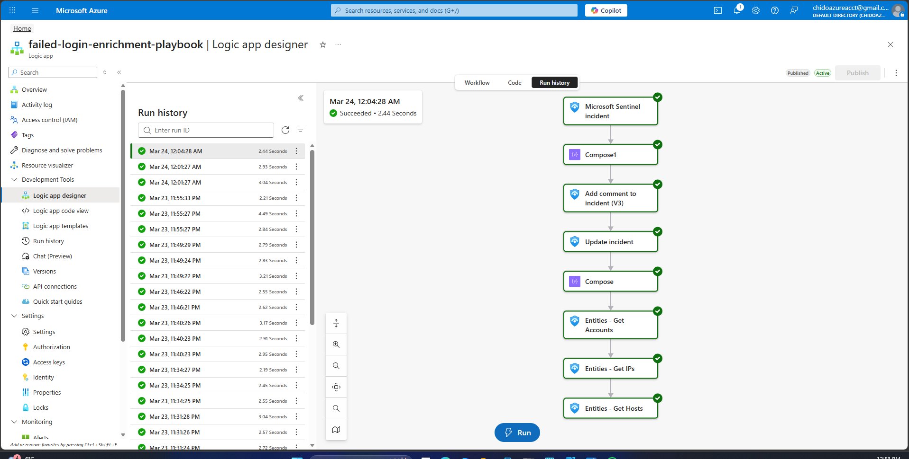
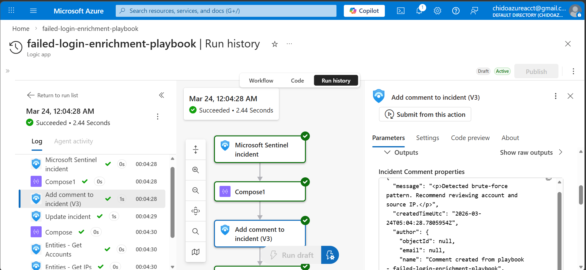
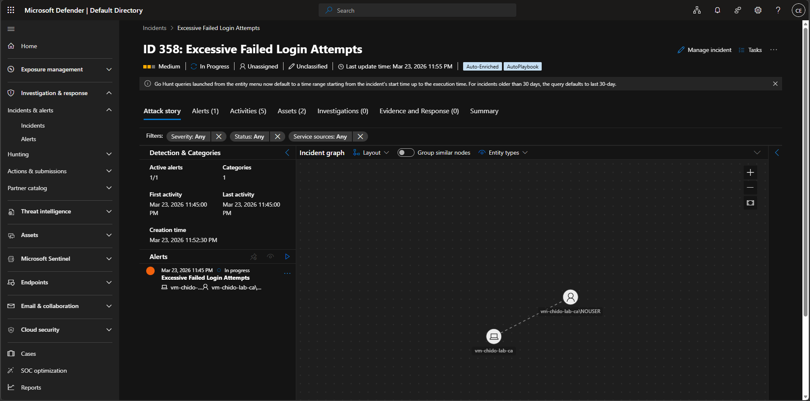
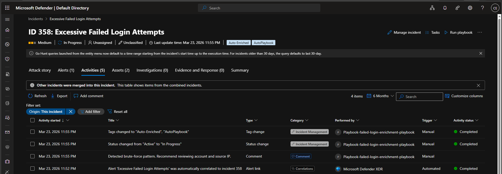

# Sentinel Incident Response Automation Lab (SOAR)
### CyberSecurity | CloudSecurity | MicrosoftSentinel | SOAR | DetectionEngineering | Azure | SIEM | SecurityAutomation | SOC | ThreatDetection



## Overview
This lab demonstrates how security detections can be transformed into **automated incident response workflows** using Microsoft Sentinel and Azure Logic Apps.

The focus is on building a **real-world SOC automation pipeline**:
- Detection → Incident Creation → Automated Enrichment → Response Actions

This project simulates how modern security teams reduce manual effort and respond to threats at scale using SOAR (Security Orchestration, Automation, and Response).

---

## Workflow
1. Security events are ingested into Log Analytics
2. Microsoft Sentinel analytics rule detects brute-force activity
3. Incident is automatically created
4. Automation rule triggers Logic App playbook
5. Playbook:
   - Adds investigation comment
   - Updates incident status
   - Applies classification tags
6. Incident is enriched and ready for analyst review

---

## Technologies Used

- Microsoft Sentinel (SIEM)
- Azure Logic Apps (SOAR)
- Log Analytics Workspace
- Azure Monitor Agent
- KQL (Kusto Query Language)
- Azure RBAC (Role-Based Access Control)
- Managed Identities

---
##  Real-World Use Case
This automation simulates how a SOC team would:
- Automatically triage brute-force attacks
- Enrich incidents before analyst review
- Reduce manual investigation time
- Standardize response actions across incidents

---

## Detection Logic

```kql
SecurityEvent
| where EventID == 4625
| summarize FailedAttempts = count() by Account, Computer, IpAddress, bin(TimeGenerated, 5m)
| where FailedAttempts > 5
| project TimeGenerated, Account, Computer, IpAddress, FailedAttempts

```
### Detection Logic Output


---

## Automation Playbook

### Actions Performed:
- Trigger: Microsoft Sentinel Incident Creation
- Add Comment:
     - "Detected brute-force pattern. Recommend reviewing account and source IP."
- Update Incident:
     - Status → Active
     - Tags → Auto-Enriched, AutoPlaybook
 
---

## Screenshots of my Results
### 🔹 Incident Triggered in Sentinel
**`See Tags added: Auto-Enriched, AutoPlaybook`**


---

### 🔹 Playbook Execution (Run History)


---

### 🔹 Add Comment To Incident Raw Output


---

### 🔹 Sentinel Incident Attack Story


---


### 🔹 Sentinel Incident Activities



---


## Operational Impact
This automation reduces:
- Mean Time to Respond (MTTR)
- Analyst fatigue from repetitive triage tasks
- Risk of missed incidents

This design aligns with real SOC goals:
- Scalable incident handling
- Consistent response workflows
- Faster threat containment


---

## Implementation Challenges & Troubleshooting Insights

### 1. RBAC & Permissions (Critical)

Playbook initially failed due to missing RBAC permissions.
To enable automation, I:
- Assigned Microsoft Sentinel Contributor role to the Logic App's Managed Identity
- Granted the Logic App permission to:
    - Read incidents
    - Update incidents
    - Add comments
- Validated automation execution through run history and API responses

### 2. Playbook Trigger Configuration

Understanding that:

- Automation Rules trigger playbooks (not the analytics rule directly)
- Correct configuration was required to ensure:
    - Trigger = Incident Creation
    - Playbook runs automatically
      
### 3. Entity Mapping Limitations
- Some events (e.g., missing IP addresses) resulted in incomplete enrichment
- Required validation of entity mappings in analytics rule

### 4. Detection vs Alert Timing
- Query results existed in Log Analytics
- But alerts were not generated due to:
    - Query time window mismatch
    - Rule execution frequency

### 5. Background Internet Noise
- Exposed VM immediately received continuous authentication attempts
- Required filtering and threshold tuning to avoid alert fatigue

---

## Security Considerations

- Used Managed Identity instead of credentials
- Applied least privilege RBAC (Sentinel Contributor)
- Ensured secure API communication between Sentinel and Logic Apps
  
---

## Key Takeaways
- Detection alone is not enough. Automation is critical at scale
- RBAC and permissions are foundational to SOAR success
- Incident enrichment significantly reduces analyst investigation time
- Even small cloud environments are constantly targeted

---

## Next Steps
- Detection-as-Code (ARM / Bicep / Terraform)
- Threat Intelligence Enrichment (IP reputation)
- Auto-remediation (IP blocking, account disable)
- Integration with external systems (ServiceNow, Slack)

---
  
### 👤 Author
**Chido Efobi**

Cloud Security | Detection Engineering | SIEM/SOAR Automation
